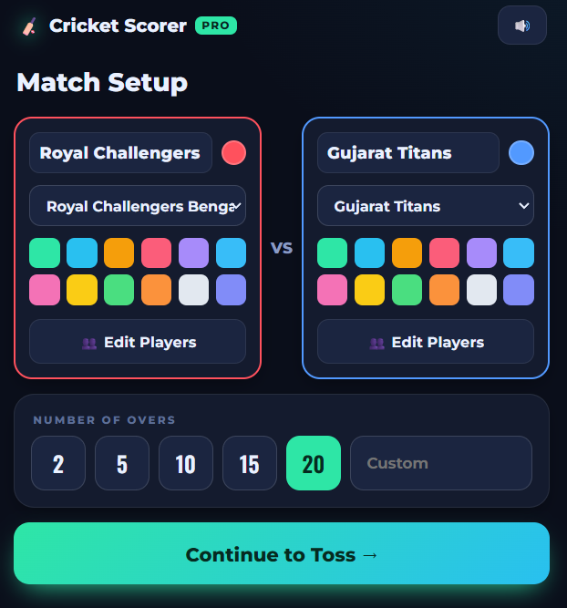
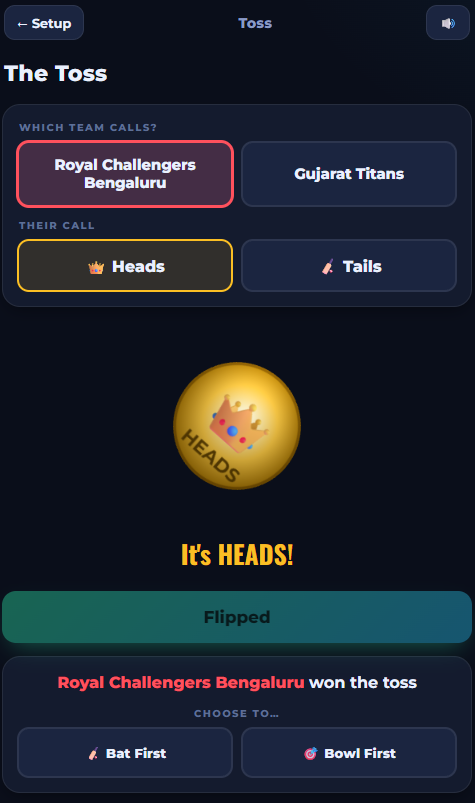
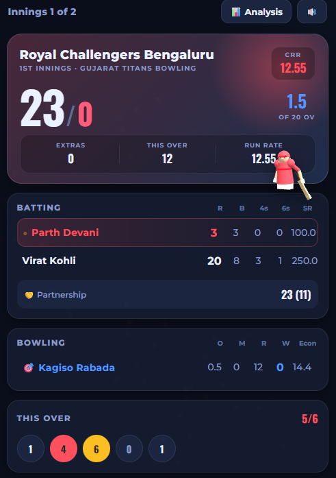
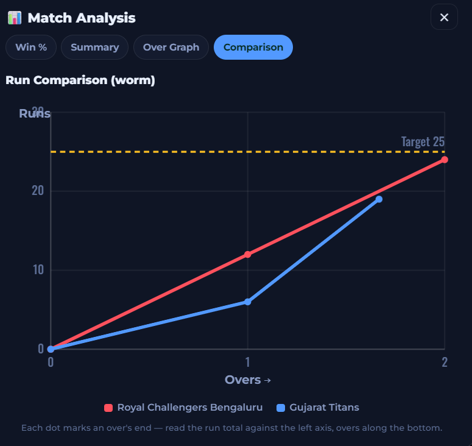
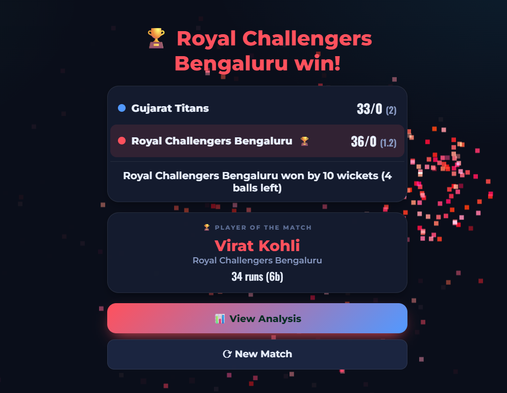

# 🏏 Cricket Scorer Pro

A simple, good-looking cricket scoring app that runs right in your browser.
No installs, no sign-up, no server — just open the file and start scoring.

Built with plain **HTML, CSS, and JavaScript**. Your match is saved on your
device, so a refresh never loses the score.

---

## 📸 Screenshots

> _Add your screenshots in a `screenshots/` folder and they'll show up here._

| Setup | Toss |
|-------|------|
|  |  |

| Live Scoring | Match Analysis |
|--------------|----------------|
|  |  |

| Result |
|--------|
|  |

---

## ✨ Features

- **Easy setup** — name both teams, pick team colours, edit the playing XI, set a captain & wicketkeeper, and choose the number of overs (or type a custom number).
- **One-tap IPL teams** — load a real IPL squad (name, colours, players) instantly.
- **Animated toss** — flip a 3D coin, call heads or tails, and choose to bat or bowl.
- **Full ball-by-ball scoring** — runs, wides, no-balls, byes, leg-byes, wickets, and a bowler for every over.
- **Live scoreboard** — batsmen stats, current bowler, this over, partnership, fall of wickets, and a run-chase panel in the 2nd innings.
- **Undo** — made a mistake? Take the last ball back.
- **Retired Hurt** and **dismissal types** (bowled, caught, lbw, run out, stumped, hit wicket).
- **Fun animations** — a 3D batsman celebrates fours and sixes, looks down after a wicket, plus fireworks for milestones and the win.
- **Sound effects** — cheers, wickets, milestones (mute anytime).
- **Match Analysis** — projected score, win probability, full scorecard, runs-per-over graph, and a run-comparison chart.
- **Player of the Match** — picked automatically at the end.
- **Auto-save** — everything is stored in your browser; close and come back later.

---

## ▶️ How to run

1. Download or clone this project.
2. Open **`index.html`** in any modern browser (Chrome, Edge, Firefox).

That's it. No build step.

> The 3D animations (coin, batsman, fireworks) load a small library from the
> internet, so keep a connection on the **first** open. The scoring itself works
> fully offline.

---

## 🗂️ Project structure

```
index.html      → all screens (setup, toss, match, result)
style.css       → styles and theme
js/
  data.js       → names, colours, constants
  teams.js      → IPL squads
  store.js      → match data + save/load
  engine.js     → scoring rules
  ui.js         → scoreboard rendering
  setup.js      → setup screen
  toss.js       → toss + coin
  fx.js         → 3D batsman, coin, fireworks
  sound.js      → sound effects
  analysis.js   → charts and stats
  app.js        → ties everything together
```

---

## 🛠️ Built with

- HTML, CSS, JavaScript (no framework)
- [Three.js](https://threejs.org/) for the 3D coin, batsman, and fireworks
- Web Audio API for sounds
- Browser `localStorage` for saving

---

## 🤝 Contributing

Pull requests are welcome. Keep it simple — plain HTML/CSS/JS, no build tools.

## 📄 License

Open source under the [MIT License](LICENSE).
